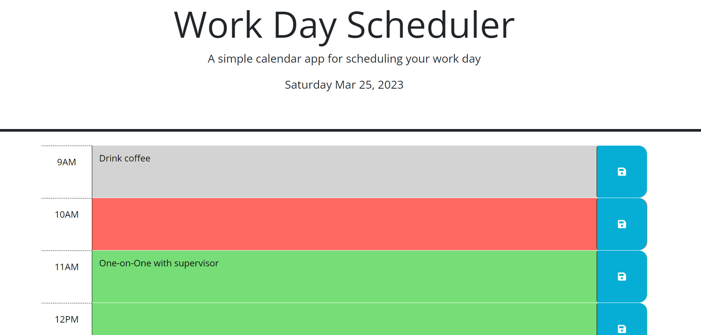

# Work-Day-Scheduler
A simple calendar application that allows a user to save events for each hour of the day. This app runs in the browser and features dynamically updated HTML and CSS powered by jQuery.

## Acceptance Criteria
When you open the planner, the current day is displayed at the top of the calendar.
When you scroll down, you are presented with time blocks for standard business hours.
When you view the time blocks for that day, each time block is color-coded to indicate whether it is in the past, present, or future.
When you click into a time block, you can enter an event.
When you click the save button for that time block, the text for that event is saved in local storage.
When you refresh the page, the saved events persist.

Deployed URL: https://batwood99.github.io/Work-Day-Scheduler/

Screenshot of application:

